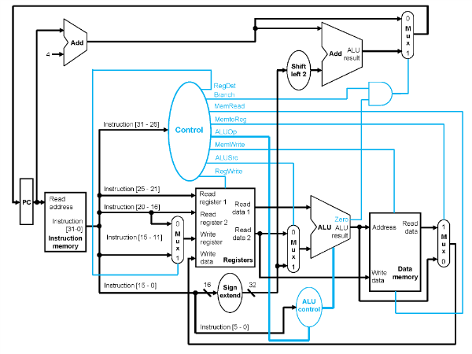

# 32-bit MIPS Single-Cycle Processor

This repository contains a structural Verilog implementation of a 32-bit MIPS Single-Cycle Processor. The design was developed as part of a Computer Architecture project at BITS Pilani to demonstrate the hardware translation of MIPS assembly into functional datapath operations.

## Datapath Architecture
The following diagram illustrates the structural interconnection of the Fetch, Decode, Execute, and Memory stages implemented in this project:

### Hardware Components
- **Control Unit:** Combinational logic that decodes the 6-bit OpCode to generate 9 distinct control signals.
- **ALU and ALU Control:** Handles arithmetic, logic, and comparison operations based on the Funct field.
- **Register File:** A 32x32-bit bank with a hardwired $zero register (Register 0) that remains 0 regardless of write operations.
- **Data Memory:** A 1024-word RAM module utilizing word-aligned addressing.

---

## Supported Instruction Set
The processor supports the following MIPS instructions. Any OpCode not listed below will result in a default 'no-operation' (nop) state.

| Instruction | Type | OpCode (Hex) | Funct (Hex) | Operation |
| :--- | :--- | :--- | :--- | :--- |
| ADD | R | 0x00 | 0x20 | $rd = $rs + $rt |
| SUB | R | 0x00 | 0x22 | $rd = $rs - $rt |
| AND | R | 0x00 | 0x24 | $rd = $rs & $rt |
| OR | R | 0x00 | 0x25 | $rd = $rs | $rt |
| SLT | R | 0x00 | 0x2A | $rd = ($rs < $rt) ? 1 : 0 |
| ADDI | I | 0x08 | N/A | $rt = $rs + SignExtImm |
| LW | I | 0x23 | N/A | $rt = Mem[$rs + SignExtImm] |
| SW | I | 0x2B | N/A | Mem[$rs + SignExtImm] = $rt |
| BEQ | I | 0x04 | N/A | if($rs == $rt) PC = PC + 4 + (BranchAddr) |

---

## Simulation and Testing (Xilinx Vivado)
1. Add all .v files from the `hdl/` directory to the Vivado project sources.
2. Add `Top_tb.v` as the simulation source.
3. Ensure the `instr.mem` file is located in the active simulation folder (typically `.../sim_1/behav/xsim/`).
4. The `Instruction_Memory` module uses the `$readmemh` system task to initialize the program at the start of simulation.
5. Run Behavioral Simulation and monitor `PC_Out` and `ALU_Result` to verify execution flow.

## Implementation Details
- **Memory Alignment:** While the Program Counter (PC) increments by 4, the internal memory arrays are word-indexed. This is handled via internal bit-shifting `[31:2]` on the address lines.
- **Reset Logic:** The system utilizes a `ResetBar` (active low) to initialize the Program Counter and Register File values to zero.

---
**Author:** Suprasad Mishra  
**Tools:** Verilog HDL, Xilinx Vivado
